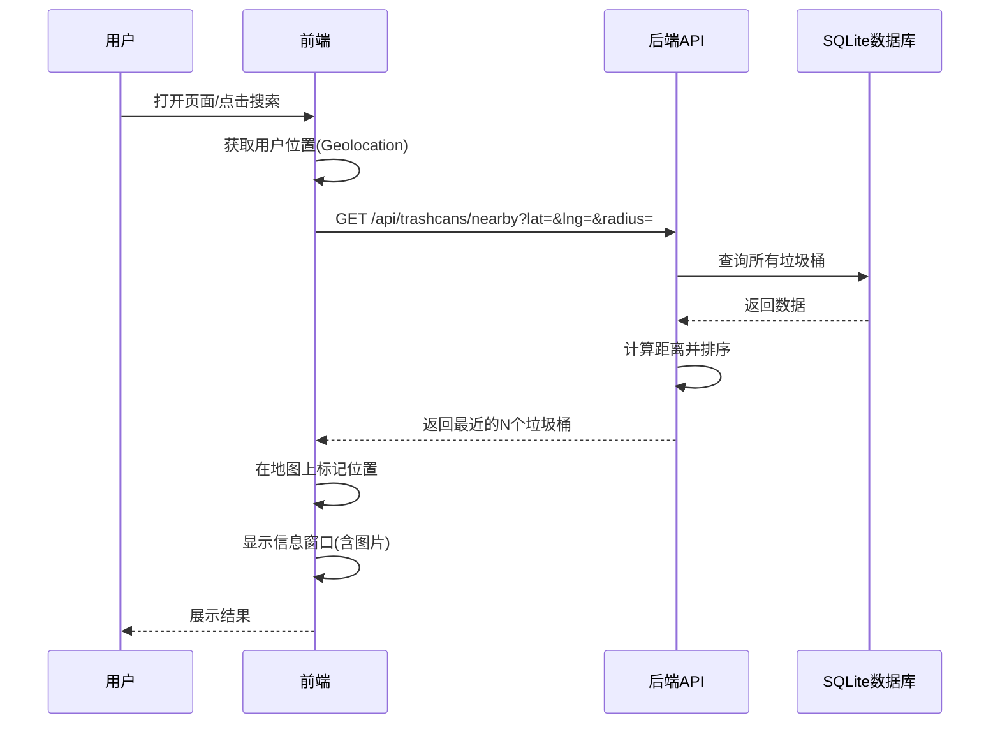
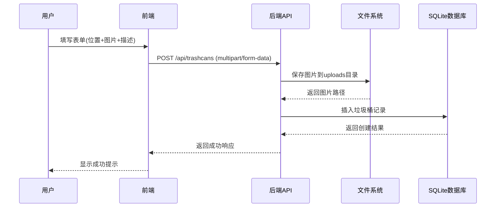

# 垃圾桶定位系统开发计划

## 项目架构

```
┌─────────────┐      HTTP/API      ┌──────────────┐
│  Vue.js前端  │ ◄────────────────► │  Gin后端API   │
│  (高德地图)  │                    │  (Go)        │
└─────────────┘                    └──────┬───────┘
                                           │
                                           ▼
                                    ┌──────────────┐
                                    │  SQLite数据库 │
                                    └──────────────┘
                                           │
                                           ▼
                                    ┌──────────────┐
                                    │  图片存储目录  │
                                    └──────────────┘
```

## 技术栈

- **后端**: Go 1.24 + Gin + GORM + SQLite
- **前端**: Vue.js 3 + 高德地图API
- **数据库**: SQLite
- **图片存储**: 本地文件系统

## 数据库设计

### 垃圾桶表 (trash_cans)

| 字段 | 类型 | 说明 |

|------|------|------|

| id | INTEGER PRIMARY KEY | 主键 |

| latitude | REAL | 纬度 |

| longitude | REAL | 经度 |

| address | TEXT | 地址描述 |

| description | TEXT | 详细描述（可选） |

| image_path | TEXT | 图片路径 |

| created_at | DATETIME | 创建时间 |

| updated_at | DATETIME | 更新时间 |

## 实现步骤

### 1. 后端开发

#### 1.1 数据模型 (`ginServer/model/trashcan.go`)

- 定义 `TrashCan` 结构体
- 实现 GORM 模型

#### 1.2 API路由 (`ginServer/router/router.go`)

- `/api/trashcans/nearby` - GET: 获取附近垃圾桶（参数：lat, lng, radius, limit）
- `/api/trashcans` - POST: 上传新垃圾桶（multipart/form-data）
- `/api/trashcans/:id` - GET: 获取垃圾桶详情
- `/api/upload/image` - POST: 图片上传接口

#### 1.3 API处理器 (`ginServer/api/trashcan.go`)

- `GetNearbyTrashCans`: 计算距离，返回最近的N个垃圾桶
- `CreateTrashCan`: 处理表单数据，保存图片，创建记录
- `GetTrashCanDetail`: 返回垃圾桶详细信息

#### 1.4 工具函数 (`utils/distance.go`)

- 实现 Haversine 公式计算两点间距离（经纬度）

#### 1.5 图片处理 (`utils/image.go`)

- 图片保存到 `uploads/trashcans/` 目录
- 生成唯一文件名
- 可选：图片压缩/缩略图生成

#### 1.6 配置更新 (`config.yml`)

- 添加高德地图API Key配置
- 添加图片上传路径配置

### 2. 前端开发

#### 2.1 项目结构 (`ui/`)

```
ui/
├── index.html          # 主页面
├── static/
│   ├── js/
│   │   ├── app.js      # Vue应用入口
│   │   ├── map.js      # 地图组件
│   │   └── upload.js   # 上传组件
│   ├── css/
│   │   └── style.css   # 样式文件
│   └── lib/
│       └── vue.min.js  # Vue.js库（CDN或本地）
```

#### 2.2 核心功能实现

**地图初始化** (`static/js/map.js`)

- 集成高德地图API
- 获取用户当前位置（Geolocation API）
- 地图中心定位到用户位置

**标记显示** (`static/js/map.js`)

- 在地图上标记垃圾桶位置
- 点击标记显示信息窗口（包含图片预览）
- 使用自定义图标区分垃圾桶

**附近搜索** (`static/js/app.js`)

- 调用 `/api/trashcans/nearby` 接口
- 在地图上显示结果
- 显示距离信息

**导航功能** (`static/js/map.js`)

- 使用高德地图导航API
- 提供"导航到此处"按钮

**图片展示** (`static/js/app.js`)

- 信息窗口显示垃圾桶图片
- 点击图片可放大查看
- 图片懒加载优化

**上传功能** (`static/js/upload.js`)

- 表单：位置选择（地图点击或手动输入经纬度）
- 图片上传（文件选择 + 预览）
- 地址描述输入
- 提交到后端API

### 3. 关键文件修改

#### 3.1 数据库初始化 (`initialize/orm/registerTables.go`)

- 注册 `TrashCan` 模型到数据库

#### 3.2 全局配置 (`global/global.go`)

- 添加数据库实例和配置结构

#### 3.3 静态文件服务 (`ginServer/router/router.go`)

- 添加图片文件静态服务路由：`/uploads/*filepath`

## 核心功能流程

### 查找附近垃圾桶流程



### 上传垃圾桶流程



## 注意事项

1. **高德地图API Key**: 需要在 `config.yml` 中配置，前端通过后端接口获取或直接在前端配置
2. **跨域问题**: 已配置CORS中间件，确保前端可以访问API
3. **图片安全**: 限制上传文件类型和大小，防止恶意文件
4. **距离计算**: 使用Haversine公式计算地球表面两点间距离
5. **性能优化**: 对于大量数据，考虑添加数据库索引（latitude, longitude）

## 后续扩展（微信小程序）

- 复用后端API接口
- 小程序端使用高德地图小程序SDK
- 利用小程序原生定位API获取用户位置
- 适配小程序UI组件库